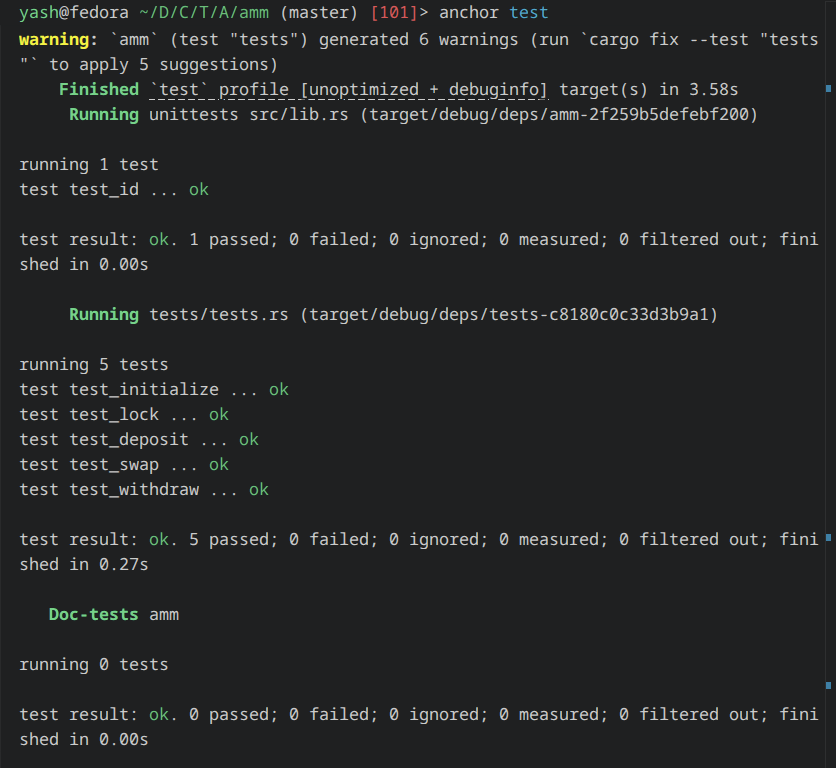

# AMM

Simple Anchor-based automated market maker built for the Turbin3 assignment.

## What it does

- `initialize` creates the pool config, LP mint, and vaults.
- `deposit` adds liquidity and mints LP tokens.
- `withdraw` burns LP tokens and returns the underlying assets.
- `swap` trades between the two pool tokens.
- `lock` toggles pool activity for admin control.

## Testing

The integration tests use `LiteSVM` and cover all main instructions.



## Run tests

From the project root:

```bash
anchor build
cargo test -q --test tests -- --nocapture
```